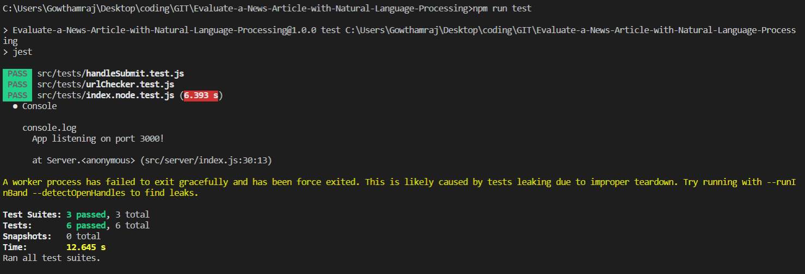
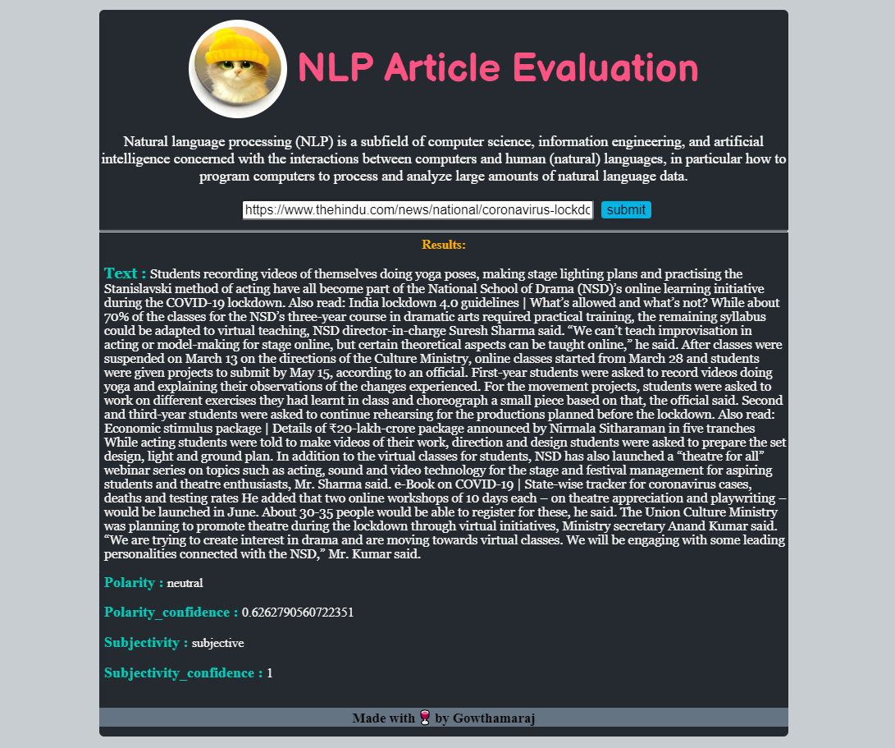

# Evaluate a news article with Natural Language Processing
This project is about build a web tool that allows users to run Natural Language Processing (NLP) on articles or blogs found on other websites.

The project is a  building web tool that allows users to run Natural Language Processing (NLP) on articles or blogs found on other websites with the help of an exciting new api called Aylien. This tool will give us back pertinent information about the article, like whether the content is subjective (opinion) or objective (fact-based) and whether it is positive, neutral, or negative in tone.

Node and express used for webserver and routing, and webpack will be our build tool of choice. Using webpack, we will set up the app to have development and production environments, each with their own set of tools and commands.

I have also added Jest to test the routes and other JavaScript functions of the application.

## Run project
Below shows how to run in development and production mode.

### Run in development mode
To start the webpack dev server at port 8080
```sh
` $ npm run build-dev`
```


### Run in production mode
Generate the dist files and then start server at port 3000
```sh
` $ npm run build-prod`
```
To start the node server, use the command given below.
```sh
` $ npm run start`
```
## Configs
I have made 2 webpack config files for both development mode(`webpack.config.dev.js`) and production mode(`webpack.config.prod.js` )

## API
The project uses the Text Analysis SDKs from [aylien](https://aylien.com/text-api/sdks/), which provides a powerful and flexible AI-driven content analysis solutions.

## Offline Functionality
The project has service workers set up in webpack to provide the offline functionality of our app. 

## Testing
Testing is done with Jest. To run test, use the command 
`npm run test`. 


## Interactions
### Home page

It is a single page web app. It has a single form input field that accepts user input(URL), then runs a check to make sure it is a valid URL. If it is not a valid URL, it will show "Invalid Input". If not, it will fetch the data using the API and display it to us.

##### In Mobiles

